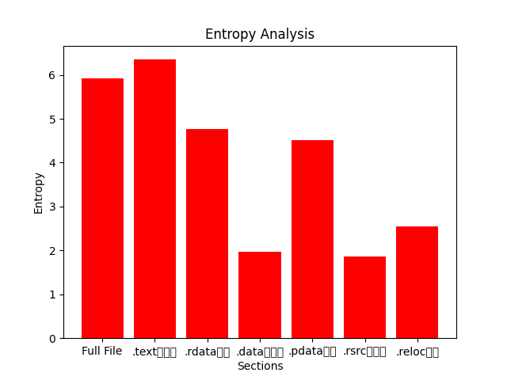
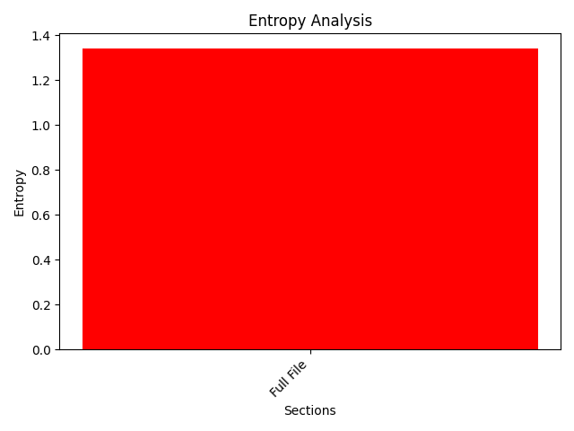

# HawkIOC - Malware Static Analysis Automation Tool

HawkIOC is a Python-based tool designed to automate a large part of the **static analysis** process for malware samples. It extracts important indicators of compromise (IOCs) and generates various hashes to assist in threat intelligence and forensics.

### v2.0 (Current)
- Added **support for ELF and Mach-O files** (cross-platform analysis beyond PE).
- Added **string categorization** (URLs, Domains, IPs, Others) with console output.
- Improved **modular structure** with `core/` and `utils/` packages.

## Features
- **File Type Identification**: Determines the file type and displays magic numbers.
- **Hash Generation**: Computes MD5, SHA256, IMPHASH, and SSDEEP hashes.
- **PE Section Hashing**: Generates SHA256 and MD5 hashes for each PE section.
- **String Extraction & Categorization**: Extracts ASCII strings, saves them to `<filename>_strings.txt`, and categorizes them into:
  - **URLs** (e.g., `http://malicious.com`)
  - **Domains** (e.g., `c2.attacker.org`)
  - **IPs** (e.g., `185.220.101.1`)
- **Entropy Calculation**: Computes file and PE section entropy to detect packing.
- **UPX Detection & Unpacking**: Identifies UPX-packed files and attempts to unpack them.
- **YARA Rule Integration**: Supports scanning files with YARA rules to identify malware families and behavioral patterns.

## Installation

### **Clone the Repository**

```bash
git clone https://github.com/pnasis/HawkIOC.git
cd HawkIOC
```

### **Dependencies**

Ensure you have the following installed:
```bash
sudo apt update && sudo apt install -y yara upx ssdeep python3-pip
pip install -r requirements.txt
```

## Usage

Run the tool with:
```bash
python3 main.py -f <malware_sample> [--yara rules.yar]
```
Example:
```bash
python3 main.py -f sample.exe
```

### **Output Files**
- Extracted strings: `<filename>_strings.txt`
- Unpacked binary (if applicable): `<filename>_unpacked.exe`

## Example Output for PE executables
```                                                                                                                              
    __  __               __   ____      ______
   / / / /___ __      __/ /__/  _/___  / ____/
  / /_/ / __ `/ | /| / / //_// // __ \/ /     
 / __  / /_/ /| |/ |/ / ,< _/ // /_/ / /___   
/_/ /_/\__,_/ |__/|__/_/|_/___/\____/\____/   
                                              


Created by: pnasis
Version: v2.0

[INFO] Analyzing: apple.exe

==================================================
                [File Information]
==================================================
[INFO] File Type: PE32+ executable for MS Windows 5.02 (GUI), x86-64, 6 sections
[INFO] Magic Numbers: 4D5A900003000000

==================================================
                [File Hashes]
==================================================
[INFO] MD5: 1c7243c8f3586b799a5f9a2e4200aa92
[INFO] SHA256: f47060d0f7de5ee651878eb18dd2d24b5003bdb03ef4f49879f448f05034a21e

==================================================
                [Fuzzy Hashing (SSDEEP)]
==================================================
[INFO] SSDEEP: 1536:b6sMD3H8V3jsUnHLiREsTbDV/48OO4vh47483gLi9+LSG:b6srVzJiRrTHVORe75g4+LS

==================================================
                [Extracting Strings]
==================================================
[INFO] Extracted 975 strings.
[INFO] Strings saved to: apple.exe_strings.txt

==================================================
                [Categorized Strings]
==================================================
[INFO] Domains Found:
   t.Hc

==================================================
                [PE File Analysis]
==================================================
[INFO] IMPHASH: 475b069fec5e5868caeb7d4d89236c89
[INFO] Section: .text, MD5: bbd3af727b760f43f79949ed12967f15, SHA256: ea37fa217219f7386ca98011dda7fac1f7f7cc24895cf9273d49640b63b01fff
[INFO] Section: .rdata, MD5: 17f740269d4d7b5a4dba2dcf5f974db6, SHA256: 66243010815564074a14e8cb5afa99ea9cc536112be06d94772b43ca02aba5cc
[INFO] Section: .data, MD5: 2e35bbdf7154182a22115a6f25bfa771, SHA256: 1649f5ba302336d40f72b66a60bea442e80cb7d203564945df36b3c37dd31b0e
[INFO] Section: .pdata, MD5: 41d59b361c2388908534d43ad9beeafc, SHA256: 8bb63485bae4c760978139368ffd882815d116d92a830c3e019355c64c75f4b0
[INFO] Section: .rsrc, MD5: 60dbb5e97fab0b4434173e100d16967c, SHA256: a10593dad8bf8d9dbcb2ba3de64444e8dc694d072885bcfde78782d785120388
[INFO] Section: .reloc, MD5: 839270e9b89f3de10367cb764b52800f, SHA256: 58cd917c1aaa4463384d70f2e8d0e60edcfed2bb8640a086fa4428b627aa3226

==================================================
                [Entropy Analysis]
==================================================
[INFO] File Entropy: 5.9184

[INFO] PE Section Entropy:
    * .text: 6.3495
    * .rdata: 4.7603
    * .data: 1.9729
    * .pdata: 4.5047
    * .rsrc: 1.8680
    * .reloc: 2.5550

[INFO] Entropy levels suggest the file is not packed.

==================================================
                [Entropy Visualization]
==================================================
[INFO] Generating entropy visualization...

==================================================
                [PE Resources]
==================================================
[INFO] Extracting PE Resources...
[INFO] Found resource type: 88

==================================================
                [Import Functions]
==================================================
[INFO] Extracting Import Functions...
[INFO] Imported Functions:
  - DLL: ADVAPI32.dll
    * RegSetValueExA
    * RegOpenKeyExA
    * RegDeleteValueA
    * RegFlushKey
    * RegCloseKey
    * CryptAcquireContextW
    * CryptDeriveKey
    * CryptReleaseContext
    * CryptEncrypt
    * CryptCreateHash
    * CryptDestroyKey
    * CryptDecrypt
    * CryptDestroyHash
    * CryptHashData
  - DLL: WININET.dll
    * HttpSendRequestA
    * InternetQueryDataAvailable
    * InternetReadFile
    * InternetCloseHandle
    * HttpQueryInfoA
    * InternetConnectA
    * InternetOpenA
    * HttpOpenRequestA
    * InternetSetOptionA
  - DLL: WS2_32.dll
    * gethostbyname
    * WSACleanup
    * WSAStartup
    * inet_ntoa
    * gethostname
  - DLL: KERNEL32.dll
    * CreateFileW
    * HeapSize
    * WriteConsoleW
    * SetStdHandle
    * LoadLibraryW
    * GetStringTypeW
    * LCMapStringW
    * LeaveCriticalSection
    * EnterCriticalSection
    * CreateFileA
    * FindResourceA
    * LoadResource
    * HeapAlloc
    * HeapFree
    * GetProcessHeap
    * WriteFile
    * SizeofResource
    * GetLastError
    * LockResource
    * GetModuleHandleA
    * CloseHandle
    * GetComputerNameA
    * HeapReAlloc
    * MoveFileExA
    * WaitForSingleObject
    * SetEvent
    * GetModuleHandleW
    * GetSystemWow64DirectoryA
    * CreateProcessA
    * GetSystemDirectoryA
    * GetEnvironmentVariableA
    * CopyFileA
    * CreateEventW
    * GetModuleFileNameA
    * DeleteFileA
    * GetFileSize
    * ReadFile
    * WideCharToMultiByte
    * GetProcAddress
    * GetTempFileNameA
    * GetTempPathA
    * FlushFileBuffers
    * GetConsoleMode
    * GetCommandLineW
    * GetStartupInfoW
    * TerminateProcess
    * GetCurrentProcess
    * UnhandledExceptionFilter
    * SetUnhandledExceptionFilter
    * IsDebuggerPresent
    * RtlVirtualUnwind
    * RtlLookupFunctionEntry
    * RtlCaptureContext
    * EncodePointer
    * DecodePointer
    * GetCPInfo
    * GetACP
    * GetOEMCP
    * IsValidCodePage
    * FlsGetValue
    * FlsSetValue
    * FlsFree
    * SetLastError
    * GetCurrentThreadId
    * FlsAlloc
    * ExitProcess
    * GetStdHandle
    * GetModuleFileNameW
    * RtlUnwindEx
    * FreeEnvironmentStringsW
    * GetEnvironmentStringsW
    * SetHandleCount
    * InitializeCriticalSectionAndSpinCount
    * GetFileType
    * DeleteCriticalSection
    * HeapSetInformation
    * GetVersion
    * HeapCreate
    * QueryPerformanceCounter
    * GetTickCount
    * GetCurrentProcessId
    * GetSystemTimeAsFileTime
    * Sleep
    * MultiByteToWideChar
    * SetFilePointer
    * GetConsoleCP
  - DLL: USER32.dll
    * GetDC

==================================================
                [Suspicious API Calls]
==================================================
[INFO] Checking for Suspicious API Calls...
[WARNING] Suspicious API Found: RegSetValueExA
[WARNING] Suspicious API Found: RegOpenKeyExA
[WARNING] Suspicious API Found: InternetReadFile
[WARNING] Suspicious API Found: InternetCloseHandle
[WARNING] Suspicious API Found: CreateFileA
[WARNING] Suspicious API Found: CloseHandle
[WARNING] Suspicious API Found: GetComputerNameA
[WARNING] Suspicious API Found: CreateProcessA

==================================================
                [XOR-encoded strings Analysis]
==================================================
[INFO] Checking for XOR-encoded strings...
[ALERT] Possible XOR-encoded strings found with key 32!

[INFO] Analysis completed!

```



## Example Output for ELF executables
```
    __  __               __   ____      ______
   / / / /___ __      __/ /__/  _/___  / ____/
  / /_/ / __ `/ | /| / / //_// // __ \/ /     
 / __  / /_/ /| |/ |/ / ,< _/ // /_/ / /___   
/_/ /_/\__,_/ |__/|__/_/|_/___/\____/\____/   
                                              


Created by: pnasis
Version: v2.0

[INFO] Analyzing: apricot

==================================================
                [File Information]
==================================================
[INFO] File Type: ELF 64-bit LSB pie executable, x86-64, version 1 (SYSV), dynamically linked, interpreter /lib64/ld-linux-x86-64.so.2, BuildID[sha1]=fec34f25ebc75fb8a5ed84f3e751108b17a789e0, for GNU/Linux 4.4.0, not stripped
[INFO] Magic Numbers: 7F454C4602010100

==================================================
                [File Hashes]
==================================================
[INFO] MD5: fe9fe5fb7c48cff03019e8690cf595e9
[INFO] SHA256: 081375e121bb7e48d548a746e8f7ec49fbeb7fbfb790e85b0e416b6ee1bdfa40

==================================================
                [Fuzzy Hashing (SSDEEP)]
==================================================
[INFO] SSDEEP: 96:R4oESB+BZOoK/4kMhq36Bp9B+hNphNAiQPUo:R1wzfK8i6tMNFA

==================================================
                [Extracting Strings]
==================================================
[INFO] Extracted 63 strings.
[INFO] Strings saved to: apricot_strings.txt

==================================================
                [Categorized Strings]
==================================================
[INFO] No categorized strings found.

==================================================
                [Entropy Analysis]
==================================================
[INFO] File Entropy: 1.3399

[INFO] Entropy levels suggest the file is not packed.

==================================================
                [Entropy Visualization]
==================================================
[INFO] Generating entropy visualization...

==================================================
                [ELF File Analysis]
==================================================
[INFO] ELF Class: 64-bit
[INFO] Entry Point: 0x1040
[INFO] Sections:
  *  (size: 0 bytes)
  * .note.gnu.property (size: 64 bytes)
  * .note.gnu.build-id (size: 36 bytes)
  * .interp (size: 28 bytes)
  * .gnu.hash (size: 28 bytes)
  * .dynsym (size: 168 bytes)
  * .dynstr (size: 143 bytes)
  * .gnu.version (size: 14 bytes)
  * .gnu.version_r (size: 48 bytes)
  * .rela.dyn (size: 192 bytes)
  * .rela.plt (size: 24 bytes)
  * .init (size: 27 bytes)
  * .plt (size: 32 bytes)
  * .text (size: 291 bytes)
  * .fini (size: 13 bytes)
  * .rodata (size: 17 bytes)
  * .eh_frame_hdr (size: 36 bytes)
  * .eh_frame (size: 124 bytes)
  * .note.ABI-tag (size: 32 bytes)
  * .init_array (size: 8 bytes)
  * .fini_array (size: 8 bytes)
  * .dynamic (size: 480 bytes)
  * .got (size: 40 bytes)
  * .got.plt (size: 32 bytes)
  * .data (size: 16 bytes)
  * .bss (size: 8 bytes)
  * .comment (size: 27 bytes)
  * .symtab (size: 576 bytes)
  * .strtab (size: 299 bytes)
  * .shstrtab (size: 278 bytes)
[INFO] Imports (Dynamic Symbols):
  - 
  - __libc_start_main
  - _ITM_deregisterTMCloneTable
  - printf
  - __gmon_start__
  - _ITM_registerTMCloneTable
  - __cxa_finalize

==================================================
                [XOR-encoded strings Analysis]
==================================================
[INFO] Checking for XOR-encoded strings...

[INFO] Analysis completed!

```



## Example Output for Mach-O executables
```
    __  __               __   ____      ______
   / / / /___ __      __/ /__/  _/___  / ____/
  / /_/ / __ `/ | /| / / //_// // __ \/ /     
 / __  / /_/ /| |/ |/ / ,< _/ // /_/ / /___   
/_/ /_/\__,_/ |__/|__/_/|_/___/\____/\____/   
                                              


Created by: pnasis
Version: v2.0

[INFO] Analyzing: kiwi

==================================================
                [File Information]
==================================================
[INFO] File Type: Mach-O 64-bit x86_64 executable, flags:<NOUNDEFS|DYLDLINK|TWOLEVEL|PIE>
[INFO] Magic Numbers: CFFAEDFE07000001

==================================================
                [File Hashes]
==================================================
[INFO] MD5: 1977b7b8dc390b7f54a1406991979189
[INFO] SHA256: 87ec984e5eed6f8f1d4bc44b2303a500439374bd7f7119007ac97838d5d3cf96

==================================================
                [Fuzzy Hashing (SSDEEP)]
==================================================
[INFO] SSDEEP: 24:xbP/8pE8hl4xltd8NmdXIfUDqKKKj40F+KHNsW3UpoqtVIbAcSmesqD7:xs/l8ltAKN+cIt+ArpD7

==================================================
                [Extracting Strings]
==================================================
[INFO] Extracted 30 strings.
[INFO] Strings saved to: kiwi_strings.txt

==================================================
                [Categorized Strings]
==================================================
[INFO] No categorized strings found.

==================================================
                [Mach-O File Analysis]
==================================================
[INFO] Mach-O Type: FILE_TYPE.EXECUTE
[INFO] Entry Point: 0x100000f10
[INFO] Libraries:
  * Command: LOAD_DYLIB
Offset:  0x3d8
Size:    0x38name=/usr/lib/libSystem.B.dylib, timestamp=2, current_version=1345.100.2,  compatibility_version=1.0.0
[INFO] Sections:
  * __text (size: 97 bytes)
  * __stubs (size: 12 bytes)
  * __cstring (size: 28 bytes)
  * __unwind_info (size: 88 bytes)
  * __got (size: 16 bytes)

==================================================
                [Entropy Analysis]
==================================================
[INFO] File Entropy: 0.9361

[INFO] Entropy levels suggest the file is not packed.

==================================================
                [Entropy Visualization]
==================================================
[INFO] Generating entropy visualization...

==================================================
                [XOR-encoded strings Analysis]
==================================================
[INFO] Checking for XOR-encoded strings...

[INFO] Analysis completed!

```


## Disclaimer

This tool is for **educational and research purposes only**. Do not use it for unethical activities.

## License

This project is licensed under the Apache 2.0 License. See the [LICENSE](LICENSE) file for details.

## Contributing

Contributions are welcome! Feel free to open issues or submit pull requests for new features, bug fixes, or documentation improvements.
